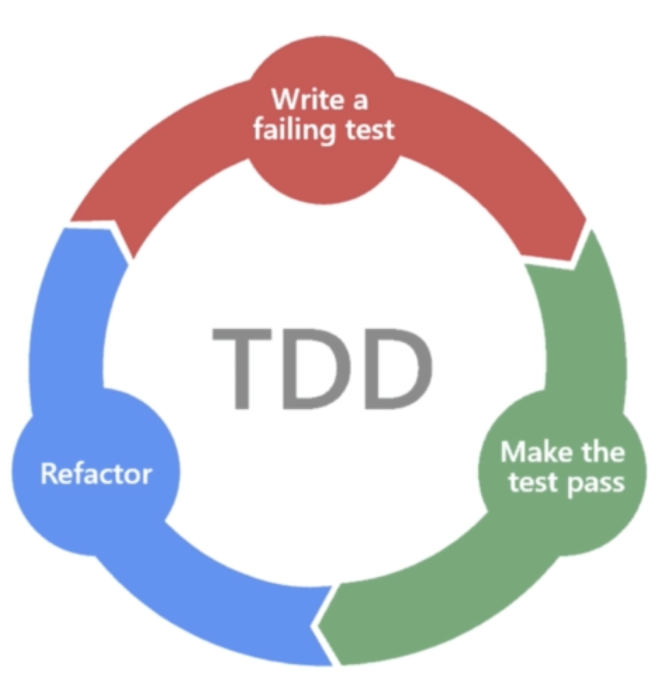

# flutter-testing-course

Application developed while doing the [Flutter testing course](https://www.udemy.com/course/flutter-testing-unit-widget-integration-testing) by [Richa HarSivo](https://harsivo.com/) on Udemy.

## Notes

### Flutter Testing

- Automated test written by developers to ensure app performs correctly before you publish it.
- The more test you write, the more stronge, robust and bug free your code becomes.

#### Why write tests?

- ***I’m paid to write code, not tests**.* A good programmer writes a clean and testable coce which is not possible without writing tests.
- ***I have tight deadlines***. Once you learn how to write tests, it makes development moves faster.
- ***We already have testers, why do we need to write tests?*** Testers don’t know the code better than developers. You can safeguard your code from any edge cases.
- Clean Code = Testable Code
- Testing ←→Bullet Proof Jacket

#### Testing Pyramid

- Unit Testing: Testing a unit of your program, like testing a function, a method, a class
- Widget Testing: To make sure this widgets are error free.
- Integration Testing: Covers a large part of your application, testing a flow (ie: login flow)

#### Testing Structure AAA

we follow this structure no matter if we are writing a Unit Test, a Widget Test or a Integration Test

- Arrange: Provide the input for the function or method we want to test
- Act: Perform, call the function or method we want to test
- Assert: We use the expect method. Check if the result received is the same as the spected value.

#### TDD: Test Driven Development Life Cycle



- In TDD we write our test before writing any functionality
- Functionality Driven Development: We have a requirement and we start working towards that requirement. We write our code driven to that functionality.
- in TDD we write the failing test for the functionality first, then we make the test pass by writing the functionality. Finally we refactor our code.

#### Unit Testing

- We need to test a unit of our code (a functionality, afunction, a class, enum, etc)
- There are certain rules to make sure we are writing good unit tests:
    - Tests should be independent of each other.
    - There should not be any implementation logic in unit test. Because that’s what we are testing.
    - Test should be simple, fast, clean and readable. It should not depend on any network call or any other task on some other thread (create mocks for that scenario)

#### How to write a unit test?

```dart
void main() {
	test('Write complete description of the test', () {
		// Arrange

		// Act

		// Assert

	});
}
```

- Filename must end with `_test`
- To make a function testable you have to inject all its dependencies (never hardcode any dependency inside the function)
- The function becomes reusable and we can test it

#### Widget Testing

In Flutter everything is a widget, so let’s write test for widgets as well!

- Test should be independent
- There should not be creating any new widget
- Test should be simple, fast, clean & readable

#### Integration Testing

- Tests the complete flow of your app
- Unit tests tests a single unit and widget tests tests a single widget in your app
- To test how those units work together, you should white integration tests
- Mockito: `flutter pub run build_runner build`